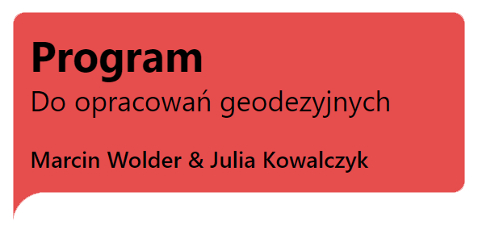
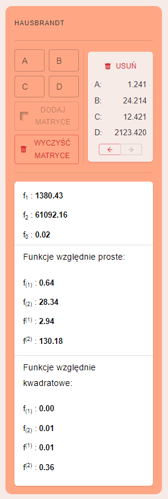
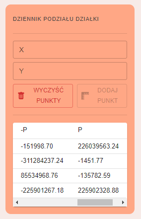
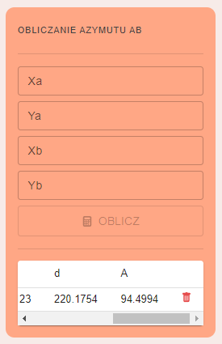

# Project for geodetic calculations

Project for geodetic calculations. Includes calculators for the most commonly used surveying operations

 

---

## Tech Stack

**Client:** React, Tailwind, MaterialUI

 

---

## Demo

#### Live DEMO:

https://obliczenia-geodezyjne.netlify.app/
